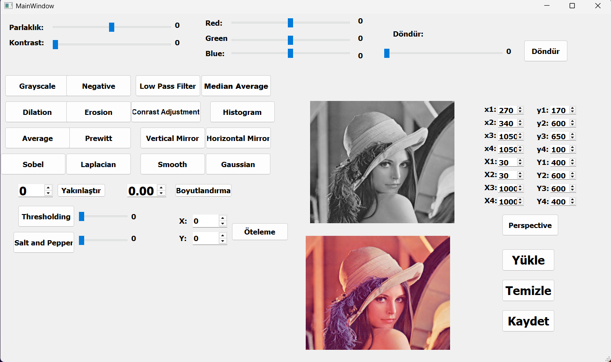

# Image-Processing-Toolset
 
Bu proje, çeşitli görüntü işleme işlemlerini kolayca gerçekleştirmenize olanak tanıyan bir araç setidir. Python ve OpenCV kullanılarak geliştirilmiştir.

## 🚀 Özellikler
- Görüntüyü gri tona çevirme
- Gauss bulanıklaştırma
- Görüntüyü yeniden boyutlandırma
- Görüntüyü döndürme
- Histogram eşitleme
- Filtreleme işlemleri (median, blur, vs.)
gibi özellikleri barındırmaktadır.

## 📸 Ekran Görüntüleri



## 📌 Gereksinimler
Bu projeyi çalıştırabilmek için aşağıdaki kütüphanelerin kurulu olması gerekmektedir:

```bash
pip install opencv-python numpy matplotlib
```

## 🔧 Kurulum ve Kullanım
1. Bu repoyu klonlayın:
```bash
git clone https://github.com/halilcanoksuz66/Image-Processing-Toolset.git
cd ./Image-Processing-Toolset/Proje
```
2. Ana betiği çalıştırın:
```bash
python app.py
```
3. İşlenmiş görüntüler belirtilen dizinde saklanacaktır.
---

**📩 İletişim**

Eğer herhangi bir sorunuz veya geri bildiriminiz varsa, benimle iletişime geçmekten çekinmeyin!

